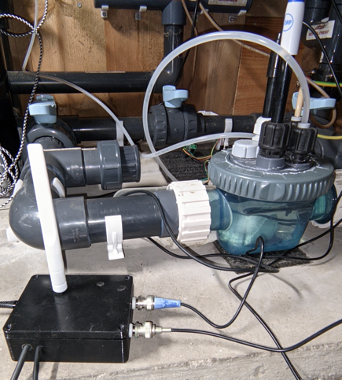

# zpool V1.0
Carte Zigbbe de gestion de piscine avec mesure pH, Orp, température et pression

**Sources :** 

https://github.com/Loic74650/pH_Orp_Board

https://www.360customs.de/fr/2019/12/orp-redox-ph-elektrometer-shield-fuer-wemos-d1-mini-mit-lmp7721-ads1115-adm3260/

https://www.ti.com/lit/ds/symlink/lmp7721.pdf?ts=1769807145680&ref_url=https%253A%252F%252Fwww.ti.com%252Fproduct%252FLMP7721

