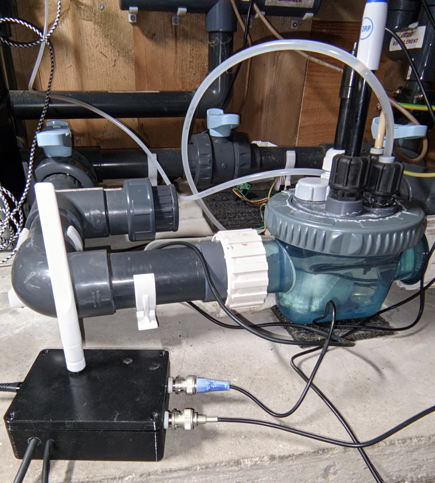

# zpool V1.0
Carte Zigbbe de gestion de piscine avec mesure pH, Orp, température et pression

**Sources :** 

https://github.com/Loic74650/pH_Orp_Board

https://www.360customs.de/fr/2019/12/orp-redox-ph-elektrometer-shield-fuer-wemos-d1-mini-mit-lmp7721-ads1115-adm3260/

https://www.ti.com/lit/ds/symlink/lmp7721.pdf?ts=1769807145680&ref_url=https%253A%252F%252Fwww.ti.com%252Fproduct%252FLMP7721

## Xiao ESP32C6
Utilisation d'un ESP32C6 pour en faire un routeur Zigbee.

Fonctionne avec Zigbee2Mqtt sous Home Assistant.

La carte mesure le pH, l’ Orp, la température et la pression.

La gestion des pompes est assurée par des prises Zigbee c’est plus simple que d’ajouter des relais à la carte.




# Programmation #
## Arduino IDE ##
Dans File - Preferences... ajouter :

```https://espressif.github.io/arduino-esp32/package_esp32_index.json```

Choisir une carte `XIAO_ESP32C6`

Dans Tools choisir `Partition scheme: ```"Zigbee ZCZR 4MB with spiffs"``` et ```"Zigbee Mode: "ZCZR" (coordinator/router)```


# Branchements #
## température et pression ##


## pH et Orp ##


# Zigbee2Mqtt #
Dans Zigbee2mqtt sous Home Assistant, laller dans le menu `Paramètres` puis `console de developpement - convertisseurs externes` :


Créer un nouvea convertisseur et coller je contenu de 


Redémarrer Zigbee2mqtt puis autoriser l'association.

# Mise à jour #

## Programmation ##

Arduino IDE

Dans File - Preferences... ajouter :

```https://espressif.github.io/arduino-esp32/package_esp32_index.json```

Choisir une carte XIAO_ESP32C6 :


Dans Tools choisir Partition scheme: "Zigbee ZCZR 4MB with spiffs" et Zigbee Mode: "ZCZR (coordinator/router)"


Et copier coller le code dans Arduino IDE :

Mettre ```Erase All Flash before sketch Upload : Disabled``` pour conserver l'appairage zigbee


Puis Upload :


